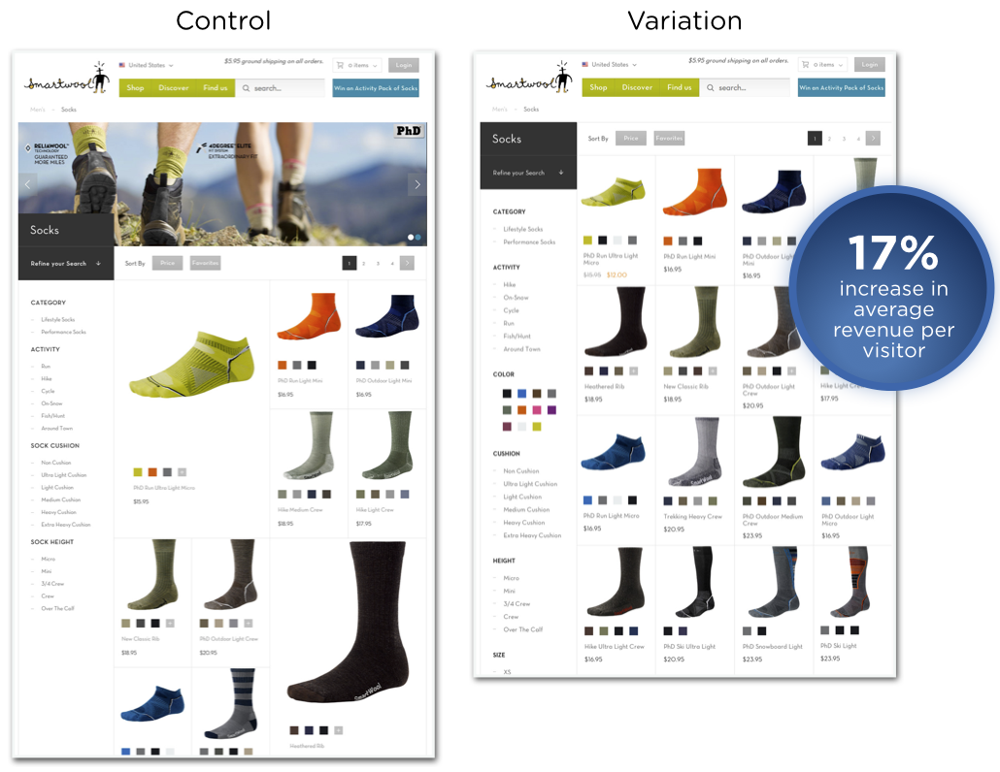

```{r setup, echo=FALSE}
setwd("~/repos/ab_test/code")
```

## 
{width=85%}

Source: splitmetrics.com


## Example A/B test

<div class="columns-2">
 {width=95%}
 
  1. Randomly assign customers to treatments
  3. Measure response(s) 
  4. Compare groups to determine how the treatment changes response
</div>

 Source: Optimizely Blog


## Why A/B tests work
By **randomizing** over a large number of customers, we create groups that are the same, on average. 

<div class="centered">
{width=15%}  {width=15%}
</div>


Any behavioral differences between these groups is **caused by the treatments** we randomly assigned. 

<div class="centered">
<div class="red2">
1, 2, 3. Repeat with me. Randomization will set you free. 
</div>
</div>


## Workshop plan {.smaller}

- Test Analysis Basics 
    - Randomization checks
    - Analysis
    - Sample size planning
- When your sample size is big
    - Slice and dice
    - Uplift modeling
    - Causal forests
- When your sample size is small
    - Pre-test matching
    - Post-stratification
- Maximizing profits
    - Test & roll
    - Multi-armed bandits
- When you can't randomize (time permitting)

## About Elea McDonnell Feit

- Professor at Drexel University 
    - Teach data-driven digital marketing and marketing experiments
    - Develop new marketing analytics tools
        - [Measuring Multi-Channel Advertising Response](https://pubsonline.informs.org/doi/abs/10.1287/mnsc.2016.2451)
        - [Test & Roll: Profit-Maximizing A/B Tests](https://papers.ssrn.com/sol3/papers.cfm?abstract_id=3274875)
    - Make analytics accessible to practitioners
        - [R for Marketing Research and Analytics](http://r-marketing.r-forge.r-project.org/)
- Previously
    - General Motors 
    - The Modellers
    - Wharton Customer Analytics

## Materials
Slides and code at https://eleafeit.github.io/ab_test/.  

R Markdown source is at https://github.com/eleafeit/ab_test/. 


## How to use the materials

We will walk through a set of examples that I created using the R (a statistical programming language). 

- **If you don't know R**, let me drive the R syntax so that you can focus on where we are going. Download the slides and follow along.
- **If you are learning R**, you should also let me drive. I can answer some R syntax questions along the way, but I don't want to get stuck in the syntatical mud. The code will be there later when you want to review.
- **If you know R well**, download the RMarkdown files and run the code as we go along.  


<div class="centered">
<div class="red2">
I'm adaptable. Please ask questions so I can calibrate.
</div>
</div>


## Let's go!

<div class="centered">
{width=70%}
</div>


