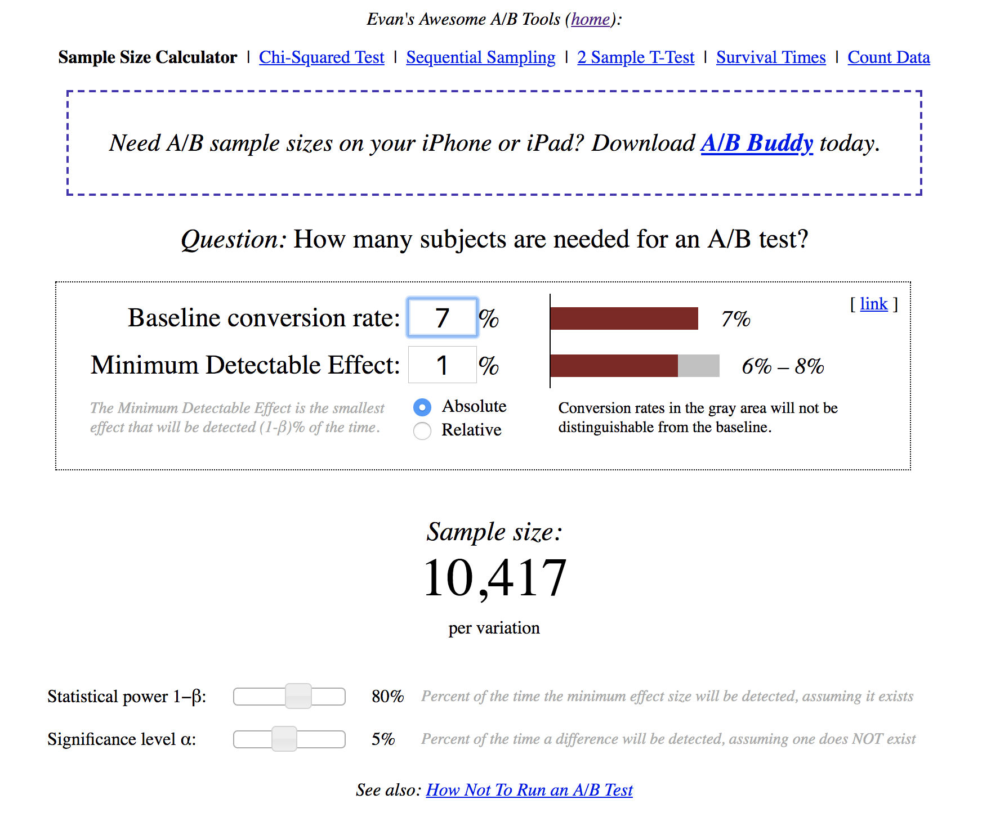

```{r setup, include=FALSE}
rm(list=ls())
setwd("~/repos/ab_test/code")
library(ggplot2)
library(dplyr)
library(tidyr)
```

# Test data

## Example email A/B test
The email A/B test we will analyze was conducted by an online wine store. 

{width=80%}  

Source: Total Wine & More  


## Wine retailer email test
**Test setting**: email to retailer email list

**Unit**: email address

**Treatments**: email version A, email version B, holdout

**Reponse**: open, click and 1-month purchase ($)

**Selection**: all active customers

**Assignment**: randomly assigned (1/3 each)


## Wine retailer email test data {.smaller}
```{r}
d <- read.csv("test_data.csv")
head(d)
```


## Types of variables associated with a test {.build}
- **Treatment indicator (x)**
    - Which (randomized) treatment was received  
     
- **Response (y's)**
    - Outcome(s) measured for each customer, AKA the dependant variable
    
- **Baseline variables (z's)**
    - Other stuff we know about customers **prior** to the randomization
    - Sometimes called "pre-randomization covariates" or "observables"

<div class="centered">
<div class="red2">
Everything measured after the randomization that could possibly be affected by the treatment is an outcome.
</div>
</div>


## Treatment indicator (x)
```{r}
summary(d$group)
```
This is a **completely randomized** experiment. 

## Responses (y's)
- open test email (load images)
- click test email to visit website
- purchases ($) in 30 days after email sent
```{r}
summary(d[,c("open", "click", "purch")])
```


## Baseline variables (z)
- days since last activity
- website visits
- total past purchases ($)
```{r}
summary(d[,c("days_since", "visits", "past_purch")]) 
```


## More baseline variables
- total past purchases by category ($)
```{r}
summary(d[, c("chard", "sav_blanc", "syrah", "cab")]) 
```

\

<div class="centered">
<div class="red2">
Whoa! That's a lot of chardonnay for one customer!
</div>
</div>


# Analysis of A/B tests


## {.build .bigger .flexbox .vcenter}

<div class="blue">
What is the first question you should ask about an A/B test? 
</div>

<div class="centered">
~~Did the treatment affect the response?~~
</div>

<div class="centered">
Was the randomization done correctly? 
</div>  

\ 

<div class="centered">
<div class="blue">
How could we check the randomization with the data?
</div>
</div>


## Randomization checks
Randomization checks confirm that the baseline variables are distributed similarly for the treatment and control groups. 

**Averages of baseline variables by treatment group**
```{r, echo=FALSE}
# alternative base-R version
# aggregate(cbind(days_since, visits, past_purch, chard, sav_blanc, syrah, cab) ~ group,
#           data=d, mean)
```
```{r}
d %>% group_by(group) %>% summarize(mean(days_since), mean(visits), mean(past_purch))
```
Group means are are similar between groups. 


## Randomization checks

Purchase incidence by group is also similar.
```{r, echo=FALSE}
# alternative base R
# aggregate(past_purch > 0 ~ group, data=d, mean)
```
```{r, echo=FALSE}
d %>% group_by(group) %>% summarize(mean(past_purch > 0))
```
About 3/4 of email list has purchased in the past and this is similar across randomized treatments.


## Randomization checks

The full distributions of baseline variables should also be the same between treatment groups.

```{r, echo=FALSE, warning=FALSE}
d %>% filter(past_purch > 0) %>% 
ggplot(aes(x=past_purch, fill=group)) + 
  geom_histogram(binwidth = 25, alpha=0.2, position="identity") +
  xlim(0, 2000) + 
  xlab("Past Purchases ($)") + ylab("Customers") + 
  labs(title="Distribution of past purchases by treatment group")
```


## Randomization checks

```{r, echo=FALSE, warning=FALSE}
d %>% filter(visits > 0) %>% 
ggplot(aes(x=visits, fill=group)) + 
  geom_histogram(binwidth = 1, alpha=0.2, position="identity") +
  xlim(0, 50) + 
  xlab("Days Since Last Activity") + ylab("Customers") + 
  labs(title="Distribution of website visits by treatment group")
```


## Exercise

Compare the past purchases in each wine category (cab, etc.) to confirm that the randomization produced groups with similar distributions.

# Randomization checks out! On to the treatment effects. 

## Did the treatments affect the responses?
```{r, echo=FALSE}
# aggregate(cbind(open, click, purch) ~ group, data=d, FUN=mean)
```
```{r}
d %>% group_by(group) %>% summarize(mean(open), mean(click), mean(purch))
```

Email A looks better for opens and clicks, but maybe not purchases. Both emails seem to generate higher average purchases than the control.


## Does email A have higher open rate than B? 
Create a new data set with just the customers who received emails. 
```{r}
d_treat <- d[d$group != "ctrl",]
d_treat$group <- droplevels(d_treat$group)
xtabs(~ group + open, data=d_treat)
```

Excluding one treatment group from an experiment is legit. 


## Confirm significance with proportions test

```{r}
prop.test(xtabs(~ group + open, data=d_treat)[,2:1]) 
```
 
 
## Visualization: open rates for emails A & B
```{r}
mosaicplot(xtabs(~ group + open, data=d_treat), 
           main="Wine Retailer Test: Email Opens")
```

 
## Does email A have a higher click rate than B? 
```{r}
xtabs(~ group + click, data=d_treat)
```


## Confirm significance with proportions test
```{r}
prop.test(xtabs(~ group + click, data=d_treat)[,2:1])
```

Note that we analyze click rate among all who *received* the email, ignoring whether or not they opened the email. There may be systematic differences in the types of customers who opened email A versus email B. 


## Visualization: barplot of clicks and opens for emails A & B
```{r, echo=FALSE}
d %>% filter(group != "ctrl") %>% group_by(group) %>% 
  summarize(open=mean(open), click=mean(click)) %>%
  gather(response, mean, -group) %>%
  ggplot(aes(fill=response, y=mean, x=group)) + 
  geom_bar(position="dodge", stat="identity") + 
  ylab("Response Rate") + xlab("")
```

 
## Do any groups have higher average purchases? 
**Average 30-day purchase amount by group**
```{r}
d %>% group_by(group) %>% summarize(mean(purch))
```


## Do any groups have higher average purchases? 
**Visualization: boxplot (old school)**
```{r, echo=FALSE, warning=FALSE}
d %>% 
  ggplot(aes(y=purch, x=group)) + 
  geom_boxplot() +
  ylab("30-Day Purchases ($)") + xlab("") + 
  scale_y_log10()
```


## Do any groups have higher average purchases? 
**Visualization: Violin plots with log scale**
```{r, echo=FALSE, warning=FALSE}
d %>%
  ggplot(aes(y=purch, x=group)) + 
  geom_violin() +
  ylab("30-Day Purchases ($)") + xlab("") + 
  scale_y_log10()
```


## Do any groups have higher average purchases? 
**Visualization: Dotplot with log scale**
```{r, echo=FALSE, warning=FALSE}
d %>%
  ggplot(aes(y=purch, x=group)) + 
  geom_dotplot(binaxis='y', stackdir='center',
               stackratio=0.1, dotsize=0.1, binwidth = 0.1) +
  ylab("30-Day Purchases ($)") + xlab("")  + 
  scale_y_log10()
```


## Test significance with a t-test
```{r}
t.test(purch ~ group, data=d[d$group != "ctrl",])
```
There is not a significant difference in average purchases between email A and email B. 


## Do emails generate higher purchases? 
```{r}
t.test(purch ~ email, data=d)
```
Those who received an email have higher average purchases (95% CI = [3.47, 4.42]).


## Summary of findings (suitable for texting)
- Email A has significantly higher opens and clicks than email B, but purchase are similar for both emails $\rightarrow$ Send email A!
- Both emails generate higher average purchases than the control $\rightarrow$ Send emails! 

# Design of A/B tests

## Seven key questions 
1. Business question
2. Test setting (lab v. field)
3. Unit of analysis (visit, customer, store)
4. Treatments
5. Response variable(s)
6. Selection of units
7. Assignment to treatments
8. Sample size

<div class="centered">
<div class="blue">
If you can answer these questions, you have a test plan. 
</div>
</div>

## Email test

**Business questions**: Does email work? If so which email is better? 

**Test setting**: email to retailer customers

**Unit**: email address

**Treatments**: email version A, email version B, holdout

**Reponse**: open, click and 30-day purchase ($)

**Selection**: all active emails on email list (open in last 12 months)

**Assignment**: randomly assigned (1/3 each)

**Sample size**: 123,988 emails


## Typical website test

**Business question**: Which version of a webpage? 

**Test setting**: website (field)

**Unit of analysis**: visitor (cookie-tracked)

**Treatments**: versions A and B

**Response variable**: clicks, conversions

**Selection of units**: all who visit

**Assignment to treatments**: random (by testing sw)

**Sample size**: ???

## Sample size planning

Significance tests will erroneously detect effects that aren't there, if you repeatedly test for significance as the data comes in and stop when you get a significant difference. 

```{r}
sig <- rep(0, 1000)
for (r in 1:1000) {
  A <- rnorm(101); B <- rnorm(101)
  pval <- rep(NA, 100)
  for (n in 1:100) pval[n] <- t.test(A[1:(n+1)], B[1:(n+1)])$p.value  # repeated testing
  if (min(pval) < 0.05) sig[r] <- 1  # any significance along the way
}
mean(sig)   # bigger than the nominal significance of 5%
```

 
## Sample size planning {.bigger, .build}

The standard recommendation is to set the sample size **in advance** and not test for significance until the data comes in.

<div class="red">
WTF? Seriously? More on this later.
</div>
</div> 

The recommended sample size is: 

<div class="centered">
$n_1 = n_2 \approx (z_{1-\alpha/2} + z_\beta)^2 \left( \frac{2 s^2}{d^2} \right)$


## Sample size planning: key ideas

- My data is noisy, so the group with the higher average in the test not always have the higher long-run response.   
- There are two mistakes you can make: 
    - Declare the treatments different, when they are the same (Type I)
    - Declare the treatment the same, when they are different (Type II)
- I want a low probability of both of those mistakes ($\alpha$, $\beta$) given a specific known difference between treatments ($d$) and noise in my response ($s$)

$n_1 = n_2 \approx (z_{1-\alpha/2} + z_\beta)^2 \left( \frac{2 s^2}{d^2} \right)$ 


## Interpreting the sample size formula

$n_1 = n_2 \approx (z_{1-\alpha/2} + z_\beta)^2 \left( \frac{2 s^2}{d^2} \right)$  

- More noise $\rightarrow$ larger sample size
- Smaller difference to detect$\rightarrow$ larger sample size
- Fewer errors $\rightarrow$ larger sample size


## Sample size calculator in R

Sample size to detect at \$1 difference in average 30-day purchases:
```{r}
sd(d$purch)
#power.t.test(sd=sd(d$purch), delta=1, sig.level=0.95, power=0.80)
```
We need 2,387 in each group. 


## Sample size planning

There is a slightly different formula for: 

**Continous response (eg money, time-on-site)**  

$n_1 = n_2 \approx (z_{1-\alpha/2} + z_\beta)^2 \left( \frac{2 s^2}{d^2} \right)$

**Binary response (eg conversions)**  

$n_1 = n_2 \approx (z_{1-\alpha/2} + z_\beta)^2 \left( \frac{2 p (1-p)}{d^2} \right)$


## Sample size calculator in R
**Binary response**
```{r}
power.prop.test(p1=0.07, p2=0.07 + 0.01, sig.level=0.05, power=0.80)
```

## Sample size calculator

{width=60%}


## A word of caution about sample size calculators {.build}

There are different  sample size formulas floating around. These formulas differ on what assumptions they may about what you are trying to do, but it can be very hard to figure out what assumptions are being made (even for experts). 

A decent sample size calculation will help you identify whether you are likely to end up with way too much or too little data. 


## Tips for getting started with A/B testing
- Keep it simple
- Be prepared to find no effect
- Choose "strong" treatments
- Run many tests in fast succession 
- You are searching for a few "golden tickets"

{width=30%}


# Things you just learned (or reviewed)
- Three types of variables in test data
    - Treatment (x's)  
    - Response (y's)  
    - Baseline variables (z's)  
- Analyzing tests with binary response  
    - Bar plot or mosaic plot 
    - `prop.test()` for significance  
- Analyzing tests with continuous response
    - Dot plots or violin plots
    - `t.test()` for significance
- Eight key questions that define a test plan
- Sample size calculations  
    - Continous responses
    - Binary responses