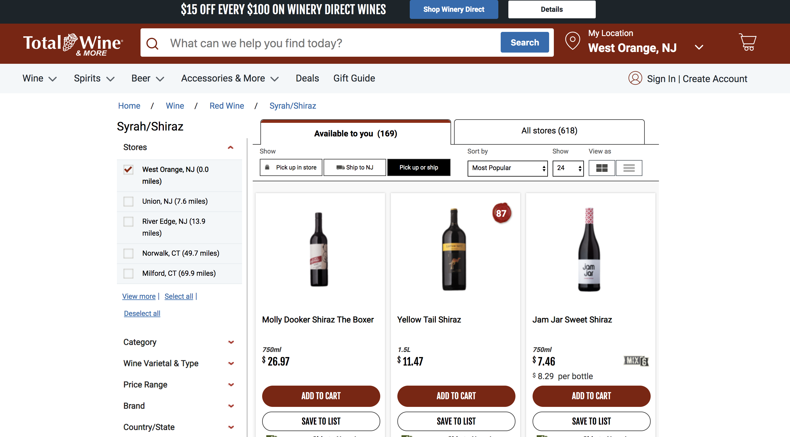
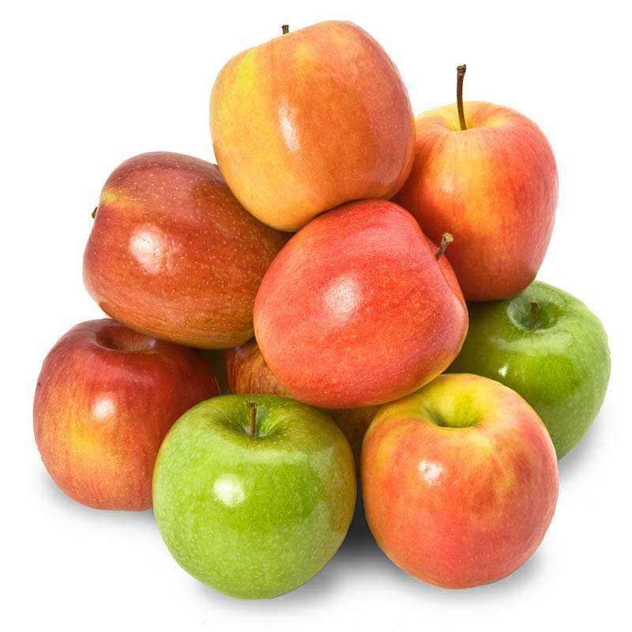
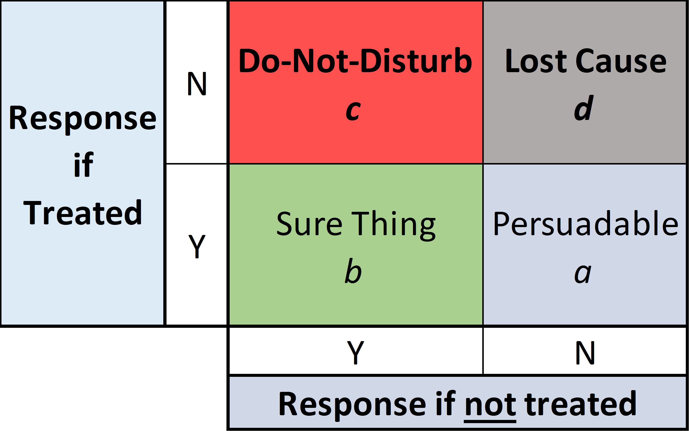
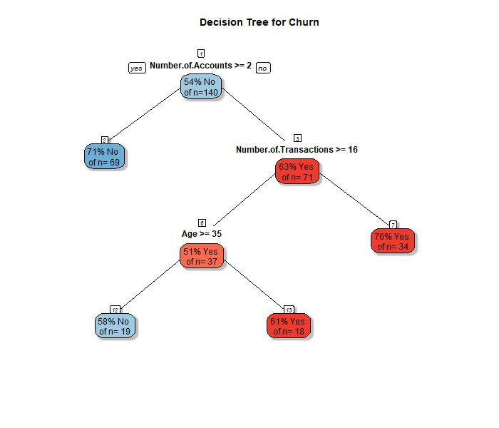
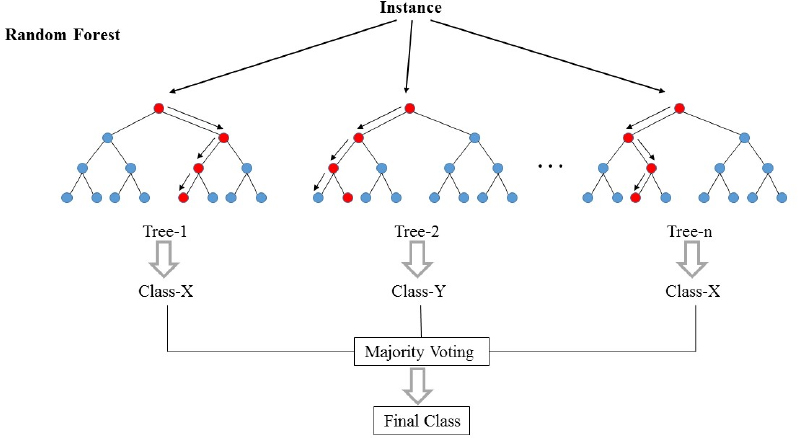

```{r setup, include=FALSE}
setwd("~/repos/ab_test/code")
library(dplyr)
library(tidyr)
library(ggplot2)
library(grf)
```


## {.flexbox .vcenter}

<div class="centered">
"When customers are randomly assigned to treatment and control groups, and there are many customers in each group, then you may effectively have multiple experiments to analyze."
</div>
- [Anderson and Simester (2011) A step-by-step guide to smart business experiments, *HBR*](https://eleafeit.github.io/ab_test/Anderson_Simester_2011.pdf) 


# Slicing and dicing


## Wine retailer experiment

{width=90%}


## Wine retailer experiment

**Test setting**: email to retailer mailing list

**Unit**: email address 

**Treatments**: email version A, email version B, holdout

**Reponse**: open, click and 1-month purchase (\$)

**Selection**: all active customers

**Assignment**: randomly assigned (1/3 each)


## Baseline variable: days since last activity
```{r, echo=FALSE}
d <- read.csv("test_data.csv")
hist(d$days_since, 
     xlab="Days Since Last Activity", ylab="Customers", 
     main="Histogram of Days Since Last Activity")
```


## Experiments within experiments {.build}

Consider the customers who have been active in the last 60 days.  

Within that subset, customers were randomly assigned to recieve email A, email B or no email.  

So, we can analyze the data for a subgroup as it's own test test by slicing down and then re-analyzing.

However, we will only find signifcant results if we have enough sample in the subgroup. 


## Recent active versus aged customers
```{r, echo=FALSE}
# aggregate(cbind(open, click, purch) ~ group + (days_since < 60), 
#          data=d, FUN=mean)
```
```{r}
d %>% group_by((days_since < 60), group) %>% summarize(mean(open), mean(click), mean(purch))
```

- The email seems to produce a stronger effect on purchases for recently active customers.


## Is email effective for recently actice? 
```{r,  warning=FALSE}
d %>% filter(email==TRUE) %>% ggplot(aes(y=purch, x=group)) + 
  geom_dotplot(binaxis='y', stackdir='center', stackratio=0.1, dotsize=0.1, binwidth=0.1) +
  ylab("30-Day Purchases ($)") + xlab("") + scale_y_log10()
```


## Significance test: recently active
```{r}
t.test(purch ~ email, data=d[d$days_since < 60,])
```


## Significance test: aged customers
```{r}
t.test(purch ~ email, data=d[d$days_since > 60,])
```


## Every A/B test can be sliced 
For example, we can look at the effect of the treatment separately for the green apples and the red apples. 
<div class="centered">
{width=30%} 
{width=30%}
</div>


## Slicing is based on baseline variables

Anyone who keeps historic data on customers or visitors has lots of baseline variables available for slicing and dicing:   

- data on previous website visits
- sign-ups
- geographic location
- source
- past purchase (by category)
- recency
- frequency


## Exercise
Re-analyze the opens, clicks and purchases for people who have bought syrah in the past. 
```{r}
summary(d$syrah > 0)
mean(d$syrah > 0)
```


## Repeated significance testing {.build}

Slicing and dicing means you will run many significance tests. 

You may remember from intro stats that 1 in 20 significance tests at 95% confidence will be significant, when there is no effect. You will get false positives, especially when slicing and dicing. 

When you think you've found a golden ticket, re-test before betting the company.


## Slicing and dicing: Summary

Slicing and dicing will reveal two things about subgroups of customers. 

1. Subgroups will vary in how much they engage in behaviors
    - Recently active tend to have higher average purchases after the email
   
2. Subgroups vary in how they respond to treatments
    - Recently active are more affected by the email


## Heterogeneous treatment effects

"Experiments are used because they provide credible estimates of the effect of an intervention for a sample population. But underlying this average effect for a sample may be **substantial variation in how particular respondents respond to treatments**: there may be **heterogeneous treatment effects**."  

-- Athey and Imbens, 2015


## Heterogeneous treatment effects and targeting
Marketers should be interested in heterogeneous treatment effects when there is opportunity to apply different treatments to each subgroup (ie targeting).

email $\rightarrow$ high potential for targeting  

website $\rightarrow$ less potential for targeting


# Analyzing experiments with regression (pre-req)

## Analyzing experiments with regression 

We use a **regression model** to define a relationship between the response ($y$) and the treatment ($x$). 

$y = a + b \times x + \varepsilon$

The model literally says that we get the average response by multiplying the treatment indicator $x$ by $b$ and adding that to $a$. When we fit a model, we use data to estimate $a$ and $b$. 


## R formulas

In R, we shorthand the model equation with an R formula: 

`purch ~ email`

This means exactly the same thing as: 

`purch` $= a + b \times$ `email` $+ \varepsilon$

where we estimate $a$ and $b$ from data.


## Analyzing an experiment with regression {.smaller}
```{r}
m1 <- lm(purch ~ email, data=d)
summary(m1)
```
Email increasaes sales by ~\$6.42 on average across all email addresses.

## Regression versus significance test {.smaller}
Regression model
```{r}
summary(m1)$coef
```
Significance test
```{r}
t.test(purch ~ email, data=d, var.equal=TRUE)
```


## Regression versus significance tests {.build}

If you like regression, you can use regression to analyze all your tests. 

If you don't like regression, you should try it because it gives you the ability to pull in baseline variables. 


## Model with a baseline variable {.smaller}

```{r}
m2 <- lm(purch ~ email + (days_since < 60), data=d)
summary(m2)$coef
```
Aged customers in the control group purchased on average \$5.55 in the 30-days after the email was sent. Recently active customers in the control group purchased an additional \$13.55. The average effect of the email was \$6.44. 

Controlling for baseline variables increases the likelihood of finding significant effects. This is sometimes called "regression correction."


## Incorporating heterogeneous treatment effects

To incorporate heterogeneous treatment effects, we need an **interaction** between the treatment effect ($x$) and a baseline variable ($z$). 

When we interact to terms, we are defining a model that multiplies the two terms: 

$y = a + b x + c  z + d (x  z) + \varepsilon$

The R formula for this model is: 

`purch ~ email + (days_since < 60)  + email:(days_since < 60)`  

or equivalently  

`purch ~ email*(days_since < 60)`  

## Incorporating heterogeneous treatment effects {.smaller}
```{r}
m3 <- lm(purch ~ email + (days_since < 60) + email:(days_since < 60), data=d)
summary(m3)$coef
```
The email effect is \$5.36 for aged customers plus an additional \$2.23 recent customers (total of \$7.59). 


# Uplift modeling (finally!)


## Uplift model for purchase amount {.smaller}
An **uplift model** is a regression model that incorporates many baseline variables. For example:
```{r}
m4 <- lm(purch ~ email*(days_since < 60) + email*(past_purch > 50) + email*(visits > 3), 
         data=d)
summary(m4)$coef
```


## Scoring customers with an uplift model
If you have someone who wasn't in the test, but you know their baseline variables, you can use an uplift model to predict likely treatment effect. 
```{r}
new_cust <- data.frame(past_purch=rep(38.12,2), days_since=rep(19,2), visits=rep(3,2))
(pred <- predict(m4, cbind(email=c(TRUE, FALSE), new_cust)))
(lift <- pred[1] - pred[2])
```
This new customer is predicted to buy \$13.03 if they get an email or \$12.40 without, for a uplift of \$0.63. 


## Scoring for another (better) customer
```{r}
new_cust <- data.frame(past_purch=rep(127.88,2), days_since=rep(19,2), visits=rep(40,2))
(pred <- predict(m4, cbind(email=c(TRUE, FALSE), new_cust)))
(lift <- pred[1] - pred[2])
```
This is a better target with an uplift of 11.61. 


## Uplift models and targeting

For costly treatments (eg catalogs, discounts) we should target customers customers that we predict will have a positive effect that exceeds costs.


## Persuadables and do-not-disturb

{width=75%}

Source: Predictive Analytics Times


## Uplift model for clicks
We can also build an uplift model for click probability, but we should use a logistic regression for binary outcomes. 
```{r}
m5 <- glm(click ~ group*(days_since < 60) + group*(past_purch > 50) + group*(visits > 3) +
                  group*(syrah > 0) + group*(cab > 0) + 
                  group*(sav_blanc > 0) + group*(chard > 0),
          family = binomial,
         data=d[d$group != "ctrl",])
```


## Uplift model for clicks {.smaller}
While email B has lower overall click rate, customers who have purchased syrah in the past are more likely to click if they get email B (which promoted syrah). 
```{r}
summary(m5)$coef
```


## More baseline variables (features)

Uplift models can include many, many baseline variables. Creating these variables from source data (CRM, web analytics data, etc) is called **feature engineering**.


# Causal forests

## Causal forests
Causal forests are an alternative to regression for identifying heterogeneous treatment effects and scoring customers based on predicted treatment effect uplift. 


## Preliminaries I: CART
Where regression models predict customer outcomes with a linear equation, cart trees predict customer outcomes using a tree structure. CARTs are estimated by finding the tree structure that seems to classify people correctly most of the time.  

{width=45%}

## Preliminaries II: Random forests
Random forests are collections of different CARTs each fit to a subset of the data. Each tree in the forest classifies customers slightly differently. Unlike a regression, a random forest can pick up non-linear relationships.  
{width=75%}

## Causal forests

Causal forests are random forests designed to categorize customers according to their **treatment effect** in an experiment. The customers in each leaf are assumed to have homogeneous treatment effects, with heterogeneous treatment effects between leaves. 

Advantages   
- Works well with a large number of baseline variables  
- Doesn't require the analyst to define cut-offs for continuous baseline variables  
- Will fit non-linear relationships between baseline variables and uplift 


## Causal forest for wine retailer experiment
```{r}
treat <- d$email
response <- d$purch
baseline <- d[, c("days_since", "past_purch", "visits", "chard", "sav_blanc", "syrah", "cab")]
cf <- causal_forest(baseline, response, treat)
print(cf)
```


## Overall average treatment effect
```{r}
average_treatment_effect(cf, method="AIPW")
```
This is similar to the estimate from our simple regression which was 6.42 (0.30). 

## Predicted uplift 
Just like any uplift model, we can use the model to predict the email effect for new customers. 
```{r}
new_cust <- data.frame(chard=38.12, sav_blanc=0, syrah=0, cab=0,  
                       past_purch=38.12, days_since=19, visits=3)
predict(cf, new_cust, estimate.variance = TRUE)
```

## Predicted uplift for all customers in test
```{r}
hist(predict(cf)$predictions, 
     main="Histogram of Purchase Lift", 
     xlab="Purchase Lift for Email", ylab="Customers")
```


## Predicted uplift versus past purchase amount
```{r}
trans_gray <- rgb(0.1, 0.1, 0.1, alpha=0.1)
plot(d$past_purch, predict(cf)$predictions, cex=0.5, col=trans_gray,
     xlab="Past Purchase Amount ($)", ylab="Predicted Treatment Effect ($)")
```


## Uplift versus days since last active
```{r}
trans_gray <- rgb(0.1, 0.1, 0.1, alpha=0.1)
plot(d$days_since, predict(cf)$predictions, cex=0.5, col=trans_gray,
     xlab="Days Since Last Active", ylab="Predicted Treatment Effect ($)")
```


## Things you just learned 
- Large sample $\rightarrow$ look for heterogeneous treatment effects using baseline variables
- Three ways to find heterogeneous treatment effects
    - Slicing and dicing: filter down then analyze sub-test
    - Uplift modeling
        - Build a regression with interactions between x and z's
        - Use logistic regression for binary response
    - Causal forests