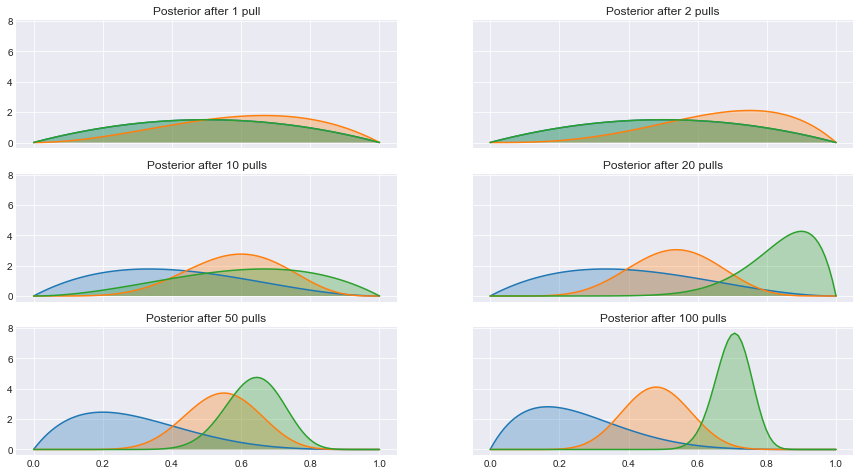
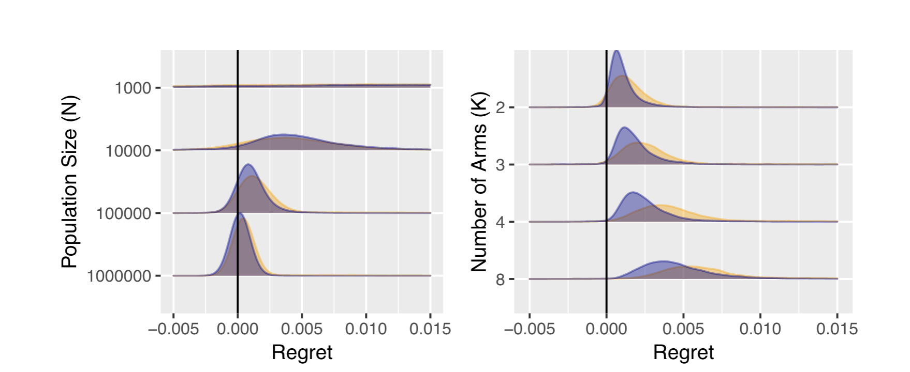
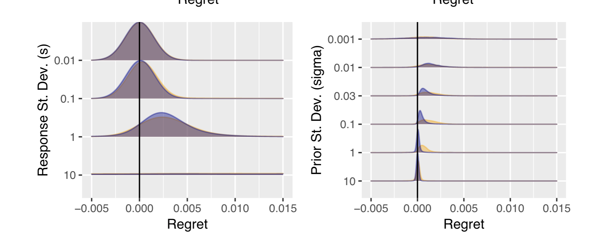
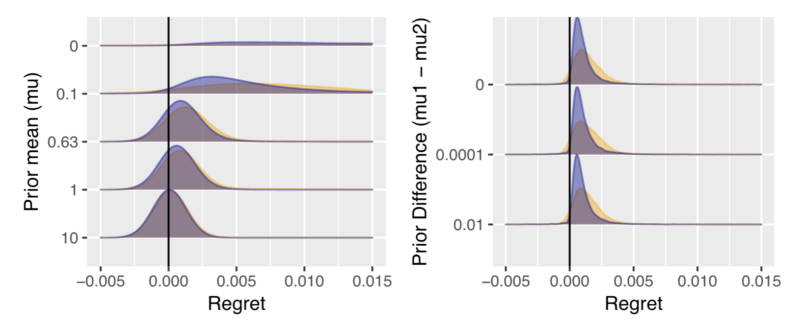

```{r setup, include=FALSE}
library(rstan)
```

# Test & Roll

## Typical A/B email test setup screen
{width=75%}

## Hypothesis testing doesn't quite fit this problem

1. Hypothesis tests focus on minimizing Type I error
    - Doesn't matter when we are deciding which treatment to deploy 

2. Populations are limited and hypothesis test 
    - Sample size formulas will suggest sample sizes larger than the population
    
3. When a hypothesis test is insignificant, it doesn't tell you what to do. 
    - Choose randomly? That doesn't make sense. 
    
4. Doesn't allow for unequal group sizes
    - But we see these all the time in media holdout testing
    
    
## A/B tests as a decision problem
### Test
Choose n1* and n2* customers to send the treatments.  
Collect data on response.  

### Roll
Choose a treatment to deploy to the remaining N - n1* - n2*.  

### Objective
Maximize combined profit for test stage and the roll stage.   


## Profit-maximizing sample size
For the case where response is normally distributed with a symmetric normal prior on the means, the profit maximizing  

$$n_1 = n_2 = \sqrt{\frac{N}{4}\left( \frac{s}{\sigma} \right)^2 + \left( \frac{3}{4} \left( \frac{s}{\sigma} \right)^2  \right)^2 } -  \frac{3}{4} \left(\frac{s}{\sigma} \right)^2$$
If the priors are different for each group (eg a holdout test), the optimal sample sizes can be found numerically.


## Profit-maximizing sample size
For the case where response is normally distributed with a symmetric normal prior on the means, the profit-maximizing sample size is

$$n_1 = n_2 = \sqrt{\frac{N}{4}\left( \frac{s}{\sigma} \right)^2 + \left( \frac{3}{4} \left( \frac{s}{\sigma} \right)^2  \right)^2 } -  \frac{3}{4} \left(\frac{s}{\sigma} \right)^2$$
Bigger population ($N$) &rightarrow bigger test  

More noise in the repsonse ($s$) > bigger test  

More prior difference between treatments ($\sigma$) > smaller test  


## Test & Roll procedure
1. Come up with priors (from past data, if you've got it)
2. Use the priors to compute the optimal sample size
3. Run the test
4. Choose the treatment with the higher posterior 
    - Which is the same if the prior are symmetric


## Hierarchical model for past experiments {.smaller}
```{}
// Stan code for Lewis and Rao 2015 data
// L&R only report the mean and standard deviation for the control group for each experiment
data {
  int<lower=1> nexpt; // number of experiments
  real<lower=2> nobs[nexpt]; // sample size for control group
  real ybar[nexpt]; // observed mean for control group
  real<lower=0> s[nexpt]; // observed standard deviation for experiment (pooled)
}
parameters {
  real m[nexpt]; // true mean for control group in experiment
  real mu; // mean across experiments
  real<lower=0> sigma; //standard deviation across experiments
}
model {
  // priors
  mu ~ normal(0, 10);
  sigma ~ normal(0, 3);
  // likelihood
  for (i in 1:nexpt) {
	  m[i] ~ normal(mu, sigma);
	  ybar[i] ~ normal(m[i], s[i]/sqrt(nobs[i])); 
  }
}
```

## Fit hierarchical model to past experiments
```{r, include=TRUE, cashe=TRUE}
lr <- read.csv("display_LewisRao2015Retail.csv")
# data taken from tables 1 and 2 of Lewis and Rao (2015)
c <- c(1:3,5:6) # include only advertiser 1 and eliminate exp 4
d1 <- list(nexpt=length(c), nobs=lr$n1[c], ybar=lr$m[c], s=lr$s[c])
m1 <- stan(file="test_roll_model.stan", data=d1, seed=20030601, 
           iter=10000)
```

## Fitted model
```{r}
summary(m1)$summary[,c(1,3,5,8)]
```

## Compute optimal sample size {.smaller}
```{r}
source("nn_functions.R")
mu <- 10.36044
sigma <- 4.39646
s <- mean(d1$s)
N <- 1000000
(n <- test_size_nn(N, s, mu, sigma))
```

## Evaluate the test {.smaller}
```{R}
(eval <- test_eval_nn(n, N, s, mu, sigma))
```

## Compare to hypothesis test 
Null hypothesis test size to detect ROI = 0 versus ROI = -100
```{r}
margin <- 0.5
d <- mean(lr$cost[c])/margin
(n_nht <- test_size_nht(s=s, d=d))  
```

## Compare to hypothesis test with finite population correction
```{r}
(n_fpc <- test_size_nht(s=s, d=d, N=N))  
(eval_fpc <- test_eval_nn(c(n_fpc, n_fpc), N, s, mu, sigma))
```


## Comparison of display ad tests
{width=100%}

# Multi-armed bandits

## Multi-armed bandits
Multi-armed bandits are a dynamic profit-maximizing approach that is more flexible than a test & roll experiment. 

- Asssign units to treatments with probability $p_k$
- Collect data 
- Adjust $p_k$ based on the data 
- Repeat


## Thompson sampling
A popular approach multi-armed bandit problems was proposed by Thompson in 1933. 

- Start with a prior
- Assign units to treatments based on the probability that the treatment is best
- Collect data
- Update prior
- Repeat

There are other methods that work better in specific contexts, but Thompson sampling is very robust.

## Thompson sampling



## Comparison of Thompson sampling and Test & Roll
{width=100%}


## Comparison of Thompson sampling and Test & Roll
{width=100%}


## Comparison of Thompson sampling and Test & Roll
{width=100%}